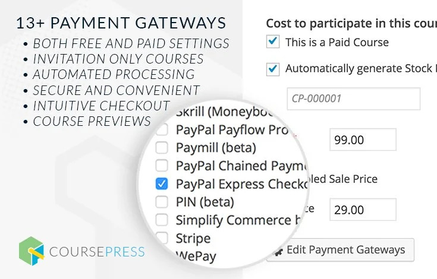
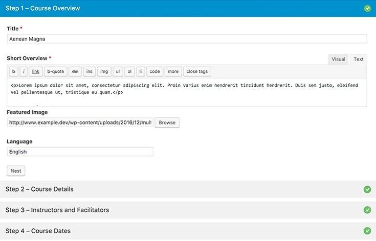
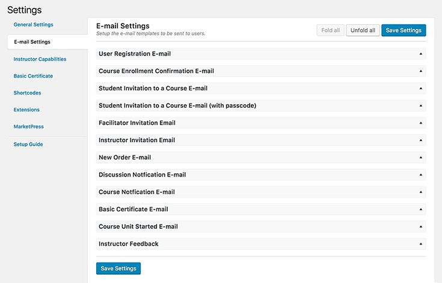
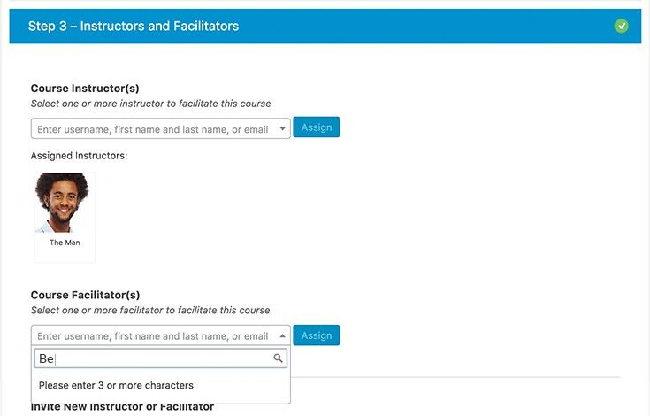
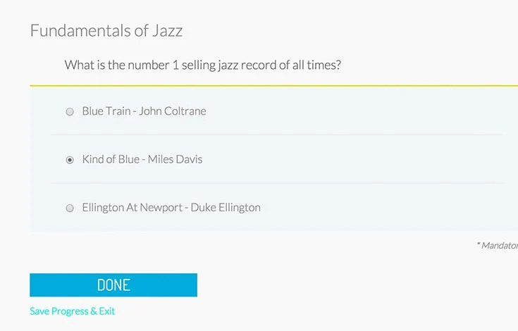
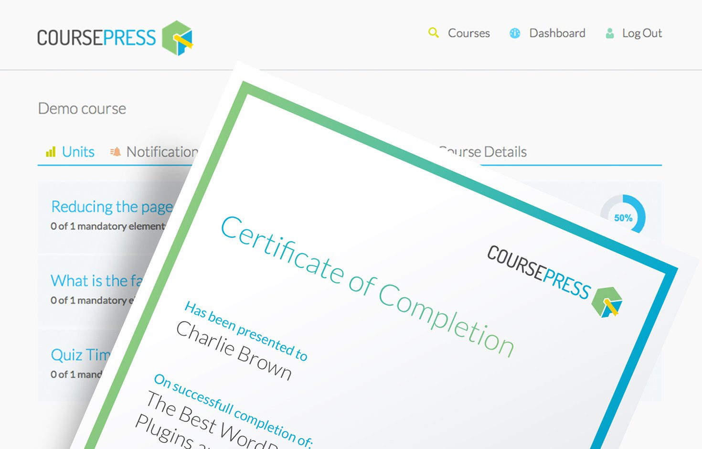
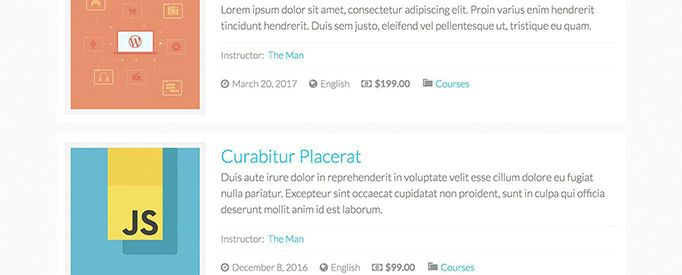
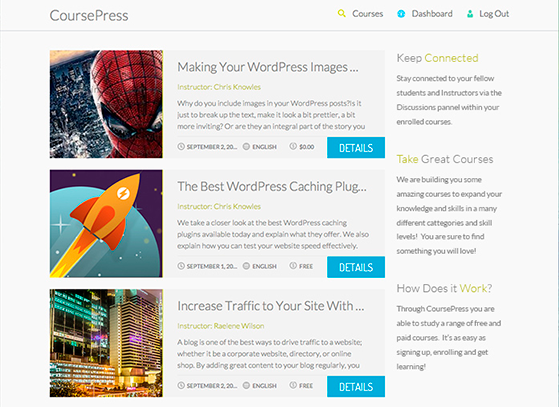
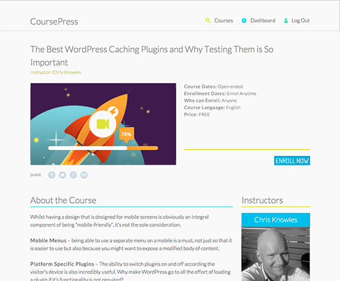

<h2 align="center" style="color:#38c2bb;">📚 CoursePress</h2>

  <a href="https://github.com/Power-Source/coursepress/discussions" style="color:#38c2bb;">💬 Forum</a>
  <a href="https://github.com/Power-Source/coursepress/releases" style="color:#38c2bb;">⬇️ Download</a>
  <a href="functions.html" style="color:#38c2bb;">🎨 Dev: Funktionen</a>
  <a href="classes.html" style="color:#38c2bb;">🌐 Dev: Klassen</a>

## Denkst Du darüber nach, Tutorials oder Kurse auf Deiner Webseite zu teilen oder zu verkaufen? Erstelle, bewerbe und verkaufe ganz einfach Dein Wissen mit CoursePress.

### Einfaches Online-Lernen

CoursePress macht Online-Lernen einfach mit Kursseiten, Paywalls, Social Sharing und einer interaktiven Lernumgebung, die dabei hilft, mehr Studenten miteinander zu verbinden.

  Gestalte Deine Kurse interaktiv mit Video, Audio, Quiz und anderen herunterladbaren Medien.

 

### Flexibler Stil

CoursePress wird mit einem eigenen Theme geliefert – gestaltet und sofort einsatzbereit. Darüber hinaus erleichtern die enthaltenen Shortcodes und Widgets die Integration von CoursePress in Deine Lieblingsthemes.

  Verwende das CoursePress-Design für vollständig gestaltete Einheiten direkt nach dem Auspacken.

### Medien und interaktives Lernen

 

   Bette Video-, Audiodateien und Bilder ein, teile herunterladbare Projektdateien, erstelle Quizfragen, ermögliche Studenten, Kursarbeiten einzureichen und an Gruppendiskussionen teilzunehmen.

  Durch die Integration von MarketPress und WooCommerce kannst Du Deine Kurse über jedes der über 100 Zahlungsgateways verkaufen.

### MarketPress & WooCommerce

Erstelle und verwalte die nächste große Academy, Tuts+ oder Lynda mit integriertem MarketPress und WooCommerce. Beginne mit der Annahme von Zahlungen mit einer der über 100 verfügbaren Zahlungsoptionen.

 

  CoursePress erleichtert die Einrichtung und Verwaltung von Schülern, Kursen und Lehrern.

### Verwalte Dein Klassenzimmer wie ein Profi

Verwalte Studenten, Dozenten und Kurse wie ein Profi mit automatischer Benotung und Berichterstattung, Beurteilungen und Diskussionen. Mit CoursePress können Studenten ihre Fortschritte von Anfang bis Ende verfolgen.

 

### Erinnerungen und Benachrichtigungen

Tropffreisetzungseinheiten und Versenden von Benachrichtigungen, wenn neues Material verfügbar ist. Automatisierte und anpassbare Benachrichtigungen helfen sowohl Schülern als auch Lehrern, den Überblick über die Kommunikation zu behalten.

  Schreibe benutzerdefinierte Folge-E-Mail-Benachrichtigungen.

 

### Weitere Möglichkeiten zum Moderieren

Stelle sicher, dass jede Frage beantwortet wird und die Aufgaben schnell bewertet werden – auch in den großen Kursen. Füge mehrere Dozenten und Kursleiter hinzu, um den Überblick über die Antworten zu behalten.

  Weise mehrere Moderatoren und Dozenten zu, die Deine Schüler unterstützen.

   

  Erstelle alle Arten von Quizzen mit Mehrfachantworten, Einzelauswahl, Upload und auswählbaren Modulen.

### Weitere Quizoptionen

CoursePress bietet mehr Möglichkeiten zur Bewertung Deiner Schüler: Mehrfachantwort, Einzelauswahl, auswählbare Antwort, kurze Antwort, lange Antwort, Richtig/Falsch und Hochladen. Fordere außerdem die Schüler auf, jede Quizeinheit mit einer qualifizierenden Note zu absolvieren, bevor sie mit der nächsten Sitzung beginnen.

 

  Erstelle individuelle Zertifikate für jeden Kurs.

### Benutzerdefinierte Abschlusszertifikate

Mit CoursePress kannst Du für jeden Kurs individuell gestaltete, personalisierte, druckbare Abschlusszertifikate erstellen.

### All-In-One-LMS

 

   CoursePress ist das komplette Learning Management System (LMS), das von Profis für Profis entwickelt wurde. Der Wissensaustausch war noch nie so einfach.

## Verwendung

### So startest Du:

Melde Dichich bei Deinem Admin-Panel für ClassicPress oder Multisite an und aktiviere das Plugin:

* Bei regulären ClassicPress-Installationen – besuche „Plugins“ und aktiviere das Plugin.
* Für ClassicPress-Multisite-Installationen – Aktiviere es Blog für Blog (z.B. wenn Du es zu einem Premium-Plugin für PS Bloghosting machen möchtest) oder besuche Netzwerkadministrator -> Plugins und Netzwerk. Aktiviere das Plugin.

### Benutzen:

Nach der Installation und Aktivierung wird in Deinem Dashboard ein neuer Menüpunkt angezeigt. _CoursePress_.

  Wenn Du auf diesen Menülink klickst, wirst Du mit einer Willkommensnachricht und kurzen Details begrüßt, die Dir den Einstieg in die Kurserstellung erleichtert.

### Einen neuen Kurs hinzufügen

Beginnen wir mit dem Hinzufügen eines Kurses. Gehe zu _CoursePress > Neuer Kurs_.

  Du siehst eine Reihe von Unterabschnitten, die einen 6-stufigen Prozess umfassen. Gehen wir sie alle durch.

##### Schritt 1 - Kursübersicht

*   Gib einen _Kursnamen_ ein.
*   Füge eine _Kurzbeschreibung_ des Kurses hinzu.
*   Optional: Lade ein _Listenbild_ hoch oder verlinke es, das für die Kursanzeige im Frontend verwendet wird.
*   Gib die _Kurssprache_ an.
*   Klicke auf den _Weiter_-Button, um zum nächsten Schritt zu gelangen.

##### Schritt 2 - Kursbeschreibung

*   Optional: Lade ein _Vorgestelltes Video_ hoch oder verlinke es, das auf der Kursdetailseite in der Kursübersicht angezeigt wird.
*   Gib eine _Kursbeschreibung_ ein – eine detaillierte Beschreibung des Kurses. Du kannst den visuellen Editor von ClassicPress voll nutzen, um die Beschreibung anzupassen.
*   Im Abschnitt _Kursstruktur_ kannst Du die Kursstruktur anpassen. Hier siehst Du auch eine Liste der Einheiten, die anfangs leer ist. Du kannst später Einheiten hinzufügen und bearbeiten.
*   Aktiviere die Option '_Kursübersichtsstruktur und Vorschauoptionen anzeigen_', um die Einheitenliste auf der Kursübersichtsseite anzuzeigen. Diese Informationen sind sonst nur für eingeschriebene Teilnehmer sichtbar.
*   Aktiviere die Option '_Zeitschätzungen für Einheiten und Lektionen anzeigen_', um eine Zeitschätzungsoption beim Bearbeiten der Einheiten einzublenden.
*   Klicke auf den _Zurück_-Button, um zum vorherigen Abschnitt zu gelangen, oder auf den _Weiter_-Button, um zum nächsten Schritt zu gelangen.

##### Schritt 3 - Dozenten

*   Du kannst im Abschnitt _Kursdozenten_ so viele Dozenten zuweisen, wie Du möchtest. Wähle einfach aus der Liste der Standard-ClassicPress-Benutzer aus.
*   Lade neue Dozenten ganz einfach per E-Mail ein. Gib im Abschnitt _Neuen Dozenten einladen_ einfach einen _Vorname_, _Nachname_ und eine _E-Mail-Adresse_ ein und klicke auf _Einladung senden_.
*   Klicke auf den _Zurück_-Button, um zum vorherigen Abschnitt zu gelangen, oder auf den _Weiter_-Button, um zum nächsten Schritt zu gelangen.

##### Schritt 4 - Kursdaten

*   Gib im Abschnitt _Kursdaten_ die Daten ein, an denen Dein Kurs verfügbar sein soll. Oder aktiviere die Option '_Dieser Kurs hat kein Enddatum_'.
*   Alternativ kannst Du das _Startdatum_ und _Enddatum_ mit dem Pop-up-Datumswähler auswählen.
*   Im Abschnitt _Einschreibedaten_ kannst Du ebenfalls die Option '_Benutzer können sich jederzeit einschreiben_' aktivieren, um eine Einschreibung jederzeit zu ermöglichen.
*   Alternativ kannst Du auch hier das _Startdatum_ und _Enddatum_ mit dem Pop-up-Datumswähler auswählen.
*   Klicke auf den _Zurück_-Button, um zum vorherigen Abschnitt zu gelangen, oder auf den _Weiter_-Button, um zum nächsten Schritt zu gelangen.

##### Schritt 5 - Klassen, Diskussionen und Arbeitsbücher

*   Um die Klassengröße zu begrenzen, aktiviere die Option '_Klassengröße begrenzen_' und gib einen Wert für die Begrenzung ein.
*   Aktiviere die Option '_Kursdiskussion erlauben_', um offene Diskussionen zwischen Studenten und Dozenten zu ermöglichen.
*   Aktiviere die Option '_Studenten-Arbeitsbuch anzeigen_', damit Studenten ihren Fortschritt sehen können.
*   Klicke auf den _Zurück_-Button, um zum vorherigen Abschnitt zu gelangen, oder auf den _Weiter_-Button, um zum nächsten Schritt zu gelangen.

##### Schritt 6 - Einschreibung und Kurskosten

Aktiviere die Option "_Dies ist ein kostenpflichtiger Kurs_", um Zahlungsoptionen anzuzeigen. Für Zahlungen integriert sich CoursePress Pro sowohl mit [MarketPress](https://cp-psource.github.io/marketpress/ "MarketPress ClassicPress e-Commerce") als auch mit [WooCommerce](https://wordpress.org/plugins/woocommerce/). Beachte bitte, dass derzeit nur eines der beiden Plugins (entweder MarketPress oder WooCommerce) aktiviert sein sollte, da die gleichzeitige Aktivierung beider Plugins zu Konflikten führen kann. 

Für die MarketPress-Integration wird dir beim ersten Aktivieren der oben genannten Zahlungsoption eine Nachricht zu MarketPress angezeigt, wie hier:

Klicke auf den Link "_MarketPress aktivieren_", um den Aktivierungsprozess zu starten und die Zahlungsoptionen freizuschalten. Für die WooCommerce-Integration stelle sicher, dass WooCommerce installiert und aktiviert ist, und aktiviere dann die Einstellung "_WooCommerce verwenden, um Kurse zu verkaufen_" unter _CoursePress Pro > Einstellungen_. Optional kannst du auch einstellen, dass WooCommerce-Produktseiten zu einem übergeordneten Kurs weiterleiten.

WooCommerce-Einstellungen unter CoursePress Pro > Einstellungen

Mit entweder MarketPress oder WooCommerce installiert und aktiviert sowie den oben konfigurierten Einstellungen werden dir dann Zahlungsoptionen für deinen Kurs angezeigt.

* Aktiviere die Option "_Automatisch eine Artikelnummer (SKU) generieren_", damit CoursePress Pro automatisch eine eindeutige SKU erstellt. Alternativ kannst du selbst einen SKU-Wert eingeben.
* Gib den _Preis_ ein.
* Aktiviere die Option "_Reduzierter Preis aktiviert_", um anzugeben, dass dieser Kurs im Angebot ist.
* Gib einen _Angebotspreis_ ein, der mit der obigen Option verwendet wird.
* Wenn du MarketPress verwendest, hast du die Möglichkeit, die _Zahlungsgateways zu bearbeiten_. Dabei wird ein Pop-up-Dialog angezeigt, in dem du die Zahlungsgateways auswählen und konfigurieren kannst.

Wenn du die Zahlungseinstellungen fertig konfiguriert hast, kannst du auf die Schaltfläche "_Zurück_" klicken, um zum vorherigen Abschnitt zu gelangen, oder auf "_Fertig_", um den Kurs-Erstellungsprozess abzuschließen und den neuen Kurs zu speichern.
### Kurse

Schauen wir uns die Kurse unter _CoursePress Pro > Kurse_ an.

Hier findest Du eine Liste aller Kurse, die Du erstellt hast.

* Nutze den Bereich _Kurse durchsuchen_, um nach bestehenden Kursen zu suchen.
* Klicke auf das _Löschen_-Symbol, um einen Kurs zu entfernen.
* Wenn Du auf den Namen eines Kurses klickst, gelangst Du zum Bearbeitungsbereich des Kurses. Ein Klick auf den Link _Studenten_ bringt Dich direkt zum Tab _Studenten_ der Bearbeitungsseite.

Auf Geräten mit großem Bildschirm siehst Du ein paar zusätzliche Optionen in der Liste.

Es gibt eine Spalte _Veröffentlicht_, in der Du Kurse ganz einfach veröffentlichen oder zurückziehen kannst.

Außerdem gibt es ein Dropdown-Menü für Massenaktionen. Du kannst mehrere Kurse in der Liste markieren, eine Aktion aus dem Dropdown-Menü auswählen und auf _Anwenden_ klicken, um die Aktion auf alle markierten Kurse anzuwenden. Die verfügbaren Massenaktionen sind:

* Veröffentlichen
* Zurückziehen
* Löschen

Wenn Du mit der Maus über einen Kurs in der Liste fährst, siehst Du eine Schnellübersicht mit Links.

Diese Links sind:

* _Bearbeiten_ – bringt Dich schnell zur Kursübersicht für diesen Kurs.
* _Einheiten_ – führt Dich zur Seite _Einheiten_.
* _Studenten_ – öffnet den Tab _Studenten_.
* _Kurs ansehen_ – zeigt den Kurs im Frontend der Seite an.
* _Einheiten ansehen_ – zeigt die Einheiten im Frontend der Seite an.

Schauen wir uns die Kursübersicht für den Kurs an, den wir zuvor erstellt haben, indem wir auf den Link _Bearbeiten_ klicken.

##### Kursübersicht

Hier siehst Du eine Reihe von Tabs (_Kursübersicht_, _Einheiten_ und _Studenten_) sowie einige andere Optionen.

*   Du siehst eine Akkordeon-Liste der verschiedenen _Schritte_, die Du zuvor erstellt hast. Klicke auf einen Schritt, um die Einstellungen anzuzeigen.
*   Veröffentliche den Kurs schnell mit dem _Kurs veröffentlichen_-Schalter.
*   Klicke auf den _Vorschau_-Button, um eine Vorschau des Kurses im Frontend der Seite zu sehen.

Lass uns zum Tab "Studenten" wechseln.

##### Studenten

Im Tab _Studenten_ kannst Du schnell auf die Studenten dieses Kurses zugreifen.

*   Füge ganz einfach einen Studenten hinzu, indem Du einen Namen aus dem Dropdown-Menü auswählst und dann auf den Button _Student hinzufügen_ klickst.
*   Klicke auf das _Abmelden_-Symbol, um einen Studenten vom Kurs abzumelden.
*   Lade einen Studenten schnell zu diesem Kurs ein, indem Du im Abschnitt "_Student einladen_" einen _Vornamen_, _Nachnamen_ und eine gültige _E-Mail-Adresse_ eingibst und dann auf _Einladen_ klickst.
*   Ein Klick auf das _Profil_-Symbol bringt Dich zur Profilseite des ausgewählten Studenten.

##### Studentenprofil

Hier siehst Du einige grundlegende Details über den Studenten sowie hilfreiche Links und eine Liste der Kurse, in die der Student eingeschrieben ist.

*   Schreibe dem Studenten schnell eine E-Mail, indem Du auf seine _E-Mail-Adresse_ klickst.
*   Klicke auf das _Bearbeiten_-Symbol, um das Benutzerkonto dieses Studenten zu bearbeiten.
*   Klicke auf den Button _Arbeitsbuch anzeigen_, um das Arbeitsbuch dieses Studenten anzusehen. Mehr dazu weiter unten.
*   Klicke auf den Kurstitel oder den _Bearbeiten_-Link daneben, um zur Kursübersichtsseite des ausgewählten Kurses zu gelangen.
*   Schau Dir diesen Kurs im Frontend der Seite an, indem Du auf das Pfeil-Symbol klickst.

Lass uns zurückgehen und den Tab "Einheiten" anschauen.

##### Einheiten

Einheiten sind der eigentliche Inhalt des Kurses. Lass uns die verschiedenen Optionen zum Hinzufügen und Bearbeiten durchgehen.

Du siehst eine Liste der vorhandenen _Einheiten_, die du anklicken kannst, um die Einstellungen zu bearbeiten. Wenn du mit der Maus über eine Einheit fährst, wird ein Pfeilsymbol angezeigt, das darauf hinweist, dass du sie ziehen kannst. Du kannst die Einheiten durch Ziehen und Ablegen neu anordnen.

Fahre mit der Maus über eine Einheit, dann ziehe und lasse sie los, um sie neu anzuordnen.

Klicke auf die Schaltfläche _Neue Einheit hinzufügen_, um eine Einheit hinzuzufügen.

In der oberen rechten Ecke dieses Tabs findest du einen _Kurs veröffentlichen_-Schalter, mit dem du den Kurs schnell veröffentlichen oder zurückziehen kannst. Darunter siehst du mehrere Unterabschnitte zum Bearbeiten der Einheit.

##### Einheitseinstellungen

*   Nutze den Schalter in der oberen rechten Ecke, um die Einheit auf _Entwurf_ oder _Live_ zu setzen.
*   Gib einen Titel in das Feld _Einheitstitel_ ein.
*   Gib ein Datum für die _Einheitenverfügbarkeit_ ein. Ein Dropdown-Menü wird angezeigt, um dir die Auswahl eines Datums zu erleichtern.
*   Aktiviere die Option '_Benutzer muss aktuelle Einheit abschließen, um auf die nächste zuzugreifen_', um zu verlangen, dass der Teilnehmer diese Einheit abschließt, bevor er weitermachen kann.
*   Klicke auf die Schaltfläche _Speichern_, um deine Änderungen zu speichern, und auf _Vorschau_, um die Einheit im Frontend deiner Seite anzusehen.
*   Klicke auf das Symbol _Einheit löschen_, um diese Einheit zu entfernen.

##### Einheitsseiten

Seiten können verwendet werden, um Abschnitte des Einheitinhalts zu trennen.

*   Wähle eine Seite aus, indem du auf eine der _Seitennummern_ klickst.
*   Füge eine Seite hinzu, indem du auf das _+_-Symbol klickst.
*   Klicke auf die Schaltfläche _Seite löschen_, um die ausgewählte Seite zu entfernen.
*   Gib einen Namen für die Seite in das Feld _Seitenbeschriftung_ ein.
*   Aktiviere die Option '_Seitenbeschriftung in Einheit anzeigen_', damit die Beschriftung dieser Seite angezeigt wird, wenn Teilnehmer die Seite im Frontend ansehen.

##### Seite erstellen

In diesem Abschnitt findest Du eine Reihe von Elementen, die Du verwenden kannst, um die Seite zu gestalten.

Klicke einfach auf eines der Element-Icons, und ein Unterabschnitt wird unten hinzugefügt, den Du konfigurieren kannst. Lass uns die einzelnen Elemente kurz durchgehen:

*   _Text_ – für einfache Texteingaben

*   _Bild_ – um Bilder hinzuzufügen

*   _Video_ – um Videoinhalte einzubinden

*   _Datei-Download_ – um eine Datei für Studenten zum Herunterladen bereitzustellen

*   _Abschnittstrennung_ – um Abschnitte optisch zu trennen

*   _Multiple Choice_ – um ein Multiple-Choice-Quiz hinzuzufügen

*   _Datei-Upload_ – ermöglicht es Studenten, eine Datei für den Dozenten hochzuladen

*   _Einzelauswahl_ – um ein Quiz mit einer Einzelauswahl zu erstellen

*   _Antwortfeld_ – stelle eine Frage und biete ein einzeiliges oder mehrzeiliges Feld für die Antworten der Studenten an

Am unteren Ende der Seite findest Du noch ein paar weitere Buttons und einen Umschalter.

*   Klicke auf den Button _Speichern_, um Deine Änderungen an der Einheit zu sichern.
*   Klicke auf den Button _Vorschau_, um die Einheit im Frontend der Seite anzusehen.
*   Nutze den Umschalter, um zwischen _Entwurf_ und _Live_-Modus zu wechseln.
### Dozenten

Kurse brauchen Dozenten – schauen wir uns an, wie Du sie unter _CoursePress Pro > Dozenten_ hinzufügen und bearbeiten kannst.

Hier findest Du eine Liste aller Dozenten, die Du eingerichtet hast. Dozenten sind im Grunde ClassicPress-Benutzer, die als Dozenten für einen Kurs zugewiesen wurden.

*   Du kannst ganz einfach im Abschnitt _Dozenten durchsuchen_ nach Dozenten suchen.
*   Klicke auf den Button _Neu hinzufügen_, um einen neuen Dozenten hinzuzufügen. Das führt Dich zur Seite _Benutzer > Neu hinzufügen_ in ClassicPress, wo Du neue Benutzer hinzufügen kannst.
*   Klicke auf die Option _Löschen_, um einen bestimmten Dozenten zu entfernen.

Auf Geräten mit großem Bildschirm siehst Du auch ein Dropdown-Menü für Massenaktionen.

Um _Massenaktionen_ zu nutzen, markiere einfach die Dozenten, die Du bearbeiten möchtest, wähle eine der Aktionen aus dem Dropdown-Menü aus und klicke auf _Anwenden_. Die verfügbaren Massenaktionen sind:

*   Löschen
*   Von allen Kursen entfernen

Ein Klick auf die Option _Profil_ bringt Dich zur Profilseite des Dozenten.

Hier siehst Du eine Liste aller _Kurse_, mit denen der Dozent verbunden ist, sowie Links zu jedem Kurs.

Außerdem gibt es einen kleinen Profilbereich mit zusätzlichen Details und einem Link _Profil bearbeiten_, der Dich zur Benutzerbearbeitungsseite für das Benutzerkonto dieses Dozenten führt.

### Studenten

Kurse brauchen auch Studenten – schauen wir uns an, wie Du sie unter _CoursePress Pro > Studenten_ hinzufügen und bearbeiten kannst.

Hier findest Du eine Liste aller Studenten, die im System eingerichtet sind. Studenten sind im Grunde ClassicPress-Benutzer, die in einem Kurs eingeschrieben sind.

*   Du kannst ganz einfach im Abschnitt _Studenten durchsuchen_ nach Studenten suchen.
*   Klicke auf den Button _Neu hinzufügen_, um einen neuen Studenten hinzuzufügen. Das führt Dich zur Seite _Benutzer > Neu hinzufügen_ in ClassicPress, wo Du neue Benutzer hinzufügen kannst.
*   Klicke auf die Option _Löschen_, um einen bestimmten Studenten zu entfernen.

Auf Geräten mit großem Bildschirm siehst Du auch ein Dropdown-Menü für Massenaktionen.

Um _Massenaktionen_ zu nutzen, markiere einfach die Studenten, die Du bearbeiten möchtest, wähle eine der Aktionen aus dem Dropdown-Menü aus und klicke auf _Anwenden_. Die verfügbaren Massenaktionen für Studenten sind:

*   Löschen
*   Von allen Kursen abmelden

Ein Klick auf die Option _Profil_ bringt Dich zur Profilseite des Studenten. Hier siehst Du eine Liste aller _Kurse_, in denen der Student eingeschrieben ist, sowie Links zu jedem Kurs. Außerdem gibt es einen kleinen Profilbereich mit zusätzlichen Details und einem Link _Profil bearbeiten_, der Dich zur Benutzerbearbeitungsseite für das Benutzerkonto dieses Studenten führt.
### Einstellungen

Lass uns die Einstellungen des Plugins unter _CoursePress Pro > Einstellungen_ durchgehen.

Hier findest Du eine Reihe von Unterabschnitten, um verschiedene Aspekte des Plugins anzupassen.

Schauen wir uns diese Unterabschnitte an, beginnend mit den allgemeinen Einstellungen.

##### Allgemein

Die allgemeinen Einstellungen beinhalten mehrere Unterabschnitte, der erste davon ermöglicht es Dir, die URL-Slugs anzupassen.

Die verfügbaren Slugs zur Anpassung, zusammen mit den Standardwerten, sind:

*   _Kurs-Slug_ http://deineseite.com/_kurse_/
*   _Einheiten-Slug_ http://deineseite.com/mein-kurs/_einheiten_/
*   _Kurs-Benachrichtigungen-Slug_ http://deineseite.com/mein-kurs/_benachrichtigungen_/
*   _Kurs-Diskussionen-Slug_ http://deineseite.com/mein-kurs/_diskussion_/
*   _Neue Kurs-Diskussionen-Slug_ http://deineseite.com/mein-kurs/diskussion/_neue_diskussion_hinzufügen_/
*   _Kurs-Bewertungen-Slug_ http://deineseite.com/mein-kurs/_bewertungen_/
*   _Kurs-Arbeitsbuch-Slug_ http://deineseite.com/mein-kurs/_arbeitsbuch_/
*   _Einschreibungsprozess-Seite_ http://deineseite.com/_einschreibungsprozess_/
*   _Login-Seite_ http://deineseite.com/_student-login_/
*   _Anmeldeseite_ http://deineseite.com/_kurse-anmeldung_/
*   _Studenten-Dashboard-Seite_ http://deineseite.com/_kurse-dashboard_/
*   _Studenten-Einstellungen-Seite_ http://deineseite.com/_einstellungen_/
*   _Dozentenprofil-Slug_ http://deineseite.com/_dozent_/

Weiter unten auf der Seite findest Du zusätzliche Einstellungen.

Passe die Einstellungen nach Deinen Bedürfnissen an und drücke den Button _Änderungen speichern_, um alles zu sichern.

##### E-Mail-Einstellungen

Im Unterabschnitt E-Mail-Einstellungen kannst Du den Inhalt der Benachrichtigungs-E-Mails des Plugins anpassen.

Folgende E-Mails kannst Du konfigurieren, zusammen mit Codes, die Du im Inhalt verwenden kannst, um dynamische Werte einzufügen:

*   _E-Mail zur Benutzerregistrierung_ – Verfügbare Codes: STUDENT_FIRST_NAME, BLOG_NAME, LOGIN_ADDRESS, COURSES_ADDRESS, WEBSITE_ADDRESS
*   _Bestätigungs-E-Mail zur Kurseinschreibung_ – Verfügbare Codes: STUDENT_FIRST_NAME, BLOG_NAME, LOGIN_ADDRESS, COURSES_ADDRESS, WEBSITE_ADDRESS, COURSE_ADDRESS
*   _Einladung eines Studenten zu einem Kurs_ – Verfügbare Codes: STUDENT_FIRST_NAME, COURSE_NAME, COURSE_EXCERPT, COURSE_ADDRESS, WEBSITE_ADDRESS
*   _Einladung eines Studenten mit Passcode zu einem Kurs_ – Verfügbare Codes: STUDENT_FIRST_NAME, COURSE_NAME, COURSE_EXCERPT, COURSE_ADDRESS, WEBSITE_ADDRESS, PASSCODE
*   _Einladung eines Dozenten_ – Verfügbare Codes: INSTRUCTOR_FIRST_NAME, INSTRUCTOR_LAST_NAME, INSTRUCTOR_EMAIL, CONFIRMATION_LINK, COURSE_NAME, COURSE_EXCERPT, COURSE_ADDRESS, WEBSITE_ADDRESS, WEBSITE_NAME

Vergiss nicht, den Button _Änderungen speichern_ zu drücken, wenn Du fertig bist.

##### Fähigkeiten der Dozenten

Dozenten haben spezielle Fähigkeiten, die es ihnen ermöglichen, Kurse zu erstellen. Lass uns diese Fähigkeiten mal genauer anschauen.

Die Fähigkeiten sind in folgende Unterabschnitte unterteilt:

_Allgemein_

* Zugriff auf das Plugin-Menü
* Zugriff auf den Menüpunkt „Kurse“
* Zugriff auf den Menüpunkt „Dozenten“
* Zugriff auf den Menüpunkt „Studenten“
* Bewertungen
* Berichte
* Benachrichtigungen
* Zugriff auf den Menüpunkt „Einstellungen“

_Kurse_

* Neue Kurse erstellen
* Alle zugewiesenen Kurse bearbeiten
* Nur eigene Kurse bearbeiten
* Alle zugewiesenen Kurse löschen
* Nur eigene Kurse löschen
* Status aller zugewiesenen Kurse ändern
* Status nur eigener Kurse ändern

_Einheiten_

* Neue Kurseinheiten erstellen
* Einheiten in allen Kursen ansehen (auch von anderen Dozenten)
* Alle Einheiten (in zugewiesenen Kursen) bearbeiten
* Nur eigene Einheiten bearbeiten
* Alle Einheiten (in zugewiesenen Kursen) löschen
* Nur eigene Kurseinheiten löschen
* Status aller Einheiten (in zugewiesenen Kursen) ändern
* Status nur eigener Kurseinheiten ändern

_Dozenten_

* Dozenten zu jedem Kurs zuweisen
* Dozenten nur zu eigenen Kursen zuweisen

_Studenten_

* Studenten zu jedem Kurs einladen
* Studenten nur zu eigenen Kursen einladen
* Studenten von jedem Kurs abmelden
* Studenten nur von eigenen Kursen abmelden
* Studenten zu jedem Kurs hinzufügen
* Studenten nur zu eigenen Kursen hinzufügen
* Studenten nur zu Kursen hinzufügen, die dem Dozenten zugewiesen sind
* Neue Benutzer mit der Rolle „Student“ im Blog hinzufügen
* Massen-E-Mails an Studenten senden
* Massen-E-Mails nur an Studenten in eigenen Kursen senden
* Studenten löschen (löscht ALLE zugehörigen Kursdaten)

_Benachrichtigungen_

* Neue Benachrichtigungen erstellen
* Neue Benachrichtigungen nur für eigene Kurse erstellen
* Neue Benachrichtigungen nur für zugewiesene Kurse erstellen
* Alle Benachrichtigungen bearbeiten
* Nur eigene Benachrichtigungen bearbeiten
* Alle Benachrichtigungen löschen
* Nur eigene Benachrichtigungen löschen
* Status aller Benachrichtigungen ändern
* Status nur eigener Benachrichtigungen ändern

Einfach die gewünschten Fähigkeiten anhaken und dann auf den Button _Änderungen speichern_ klicken, um alles zu sichern.

##### Shortcodes

CoursePress Pro bietet zahlreiche Shortcodes, die du in den Inhaltsbereichen deiner Website verwenden kannst, um Plugin-Funktionen nach Bedarf bereitzustellen.

Hier findest du eine detaillierte Übersicht, die dir bei den Shortcodes hilft. Hier ist eine Liste aller Shortcodes mit einigen hilfreichen Infos:

*   _Dozentenliste_ [course_instructors] Zeigt eine Liste oder Anzahl von Dozenten an (Gravatar, Name und Link zur Profilseite).
*   _Dozenten-Avatar_ [course_instructor_avatar] Zeigt den Avatar eines Dozenten an.
*   _Dozenten-Profil-URL_ [instructor_profile_url] Gibt die URL zum Dozentenprofil zurück.
*   _Kursdetails_ [course] Dieser Shortcode zeigt Details zu deinem Kurs an. Hinweis: Alle Informationen können auch mit den spezifischen Kurs-Shortcodes unten abgerufen werden.
*   _Kurstitel_ [course_title] Zeigt den Kurstitel an.
*   _Kurszusammenfassung_ [course_summary] Zeigt die Kurszusammenfassung/Auszug an.
*   _Kursbeschreibung_ [course_description] Zeigt die längere Kursbeschreibung (Post-Inhalt) an.
*   _Kursstartdatum_ [course_start] Zeigt das Startdatum des Kurses an.
*   _Kursenddatum_ [course_end] Zeigt das Enddatum des Kurses an.
*   _Kursdaten_ [course_dates] Zeigt den Zeitraum von Start- bis Enddatum des Kurses an. Typischerweise als [course_start] - [course_end].
*   _Einschreibungsstart_ [course_enrollment_start] Zeigt das Startdatum der Kurseinschreibung an.
*   _Einschreibungsende_ [course_enrollment_end] Zeigt das Enddatum der Kurseinschreibung an.
*   _Einschreibungszeitraum_ [course_enrollment_dates] Zeigt den Zeitraum von Start- bis Enddatum der Einschreibung an. Typischerweise als [course_enrollment_start] - [course_enrollment_end].
*   _Einschreibungsart_ [course_enrollment_type] Zeigt die Art der Einschreibung (manuell, Voraussetzung, Passcode oder für alle).
*   _Klassengröße_ [course_class_size] Zeigt die Klassengröße, Begrenzungen und verbleibenden Plätze an.
*   _Kurskosten_ [course_cost] Zeigt die Kosten für den Kurs oder "kostenlos" für unbezahlte Kurse an.
*   _Kurssprache_ [course_language] Zeigt die Sprache des Kurses an (falls festgelegt).
*   _Kurslistenbild_ [course_list_image] Zeigt das Kurslistenbild an. (Siehe [course_media])
*   _Kurs-Feature-Video_ [course_featured_video] Betten einen Videoplayer mit dem Feature-Video des Kurses ein. (Siehe [course_media])
*   _Kurs-Thumbnail_ [course_thumbnail] Zeigt das Thumbnail-Bild des Kurses an, das aus dem Listenbild generiert wird. (Siehe [course_media])
*   _Kursmedien_ [course_media] Zeigt entweder das Listenbild oder das Feature-Video an (mit der anderen Option als möglichem Fallback).
*   _Kursbeitritts-Button_ [course_join_button] Zeigt den Beitreten-/Anmelden-/Einschreibungs-Button für den Kurs an. Was angezeigt wird, hängt von den Kurseinstellungen und dem Status/Einschreibung des Nutzers ab. Siehe die Attribute für mögliche Button-Beschriftungen.
*   _Kursaktions-Links_ [course_action_links] Zeigt "Kursdetails" und "Abmelden"-Links für Studenten an.
*   _Kurskalender_ [course_calendar] Zeigt den Kurskalender an (Begrenzungen durch Start- und Enddatum des Kurses). Versucht immer, zuerst das heutige Datum im Kalender anzuzeigen.
*   _Kursliste_ [course_list] Zeigt eine Liste von Kursen an. Kann für alle Kurse oder eingeschränkt auf Dozenten oder Studenten sein (nur eines von beiden, wenn beides angegeben ist, wird nur Studenten verwendet).
*   _Feature-Kurs_ [course_featured] Zeigt einen hervorgehobenen Kurs an.
*   _Kursstruktur_ [course_structure] Zeigt eine Baumansicht der Kursstruktur an.
*   _Kursanmeldung/Login-Seite_ [course_signup] Zeigt eine benutzerdefinierte Login- oder Anmeldeseite für die Frontend-Benutzerregistrierung und -anmeldung an. Hinweis: Dies ist bereits Teil von CoursePress und kann in den CoursePress-Einstellungen festgelegt werden. Links zu Standardseiten findest du unter Design > Menüs > CoursePress.
*   _Studenten-Dashboard-Template_ [courses_student_dashboard] Lädt das Studenten-Dashboard-Template.
*   _Studenten-Einstellungen-Template_ [courses_student_settings] Lädt das Studenten-Einstellungen-Template.

##### View Setup Guide

 This is just a quick link back to the welcome page, so you'll always have access to the 'Getting Started' section through this link.

### The CoursePress Pro Theme

CoursePress Pro works with any standard ClassicPress theme, but it also includes a built-in theme to help you get started. Lets switch to that theme at _Appearance > Themes_. 

 Locate the _CoursePress_ theme in the themes list. 

 Click the _Activate_ button to activate it!

### Widgets

CoursePress Pro also includes a number of widgets for use in your theme's sidebar areas, as follows:

*   _Featured Course_ - displays a featured Course

*   _Latest Courses_ - shows a list of recently published Courses

### The User Experience

Lets take a look at the front-end experience from the user's standpoint! Here's an example of how it could look with the CoursePress theme when viewing the front page. 

 Clicking the _Details_ link or the Course's image takes you to the Details page for the selected Course. 

